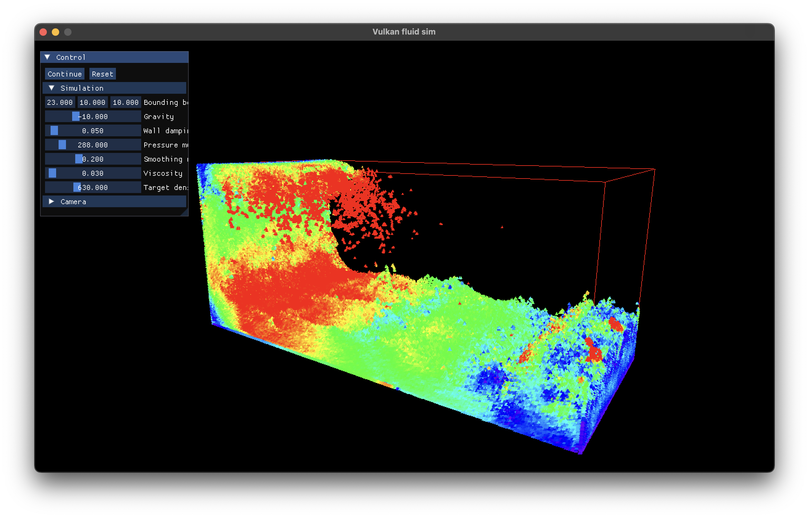

# Vulkan fluid simulation

This is a simple 3D SPH fluid simulation written in C++ and Vulkan. All the simulation is done through compute shaders and all the data buffers are kept in the GPU.

## Building

To build the project, you will need

- A compiler with C++20 support
- CMake
- Vulkan SDK

CMake will download almost all dependencies, except the Vulkan SDK which must be in the path.

## Roadmap

- [x] Simulation of 3D scenes with SPH.
- [x] Implementation of WCSPH model with viscosity.
- [x] Load object files in OBJ format.
- [x] Object and boundary interaction using [volume maps](https://animation.rwth-aachen.de/media/papers/67/2020-TVCG-ImplicitBoundaryHandling.pdf).
- [x] Configurable scene using a JSON file.
- [ ] Improve volume map using higher order interpolation (e.g. with serendipity points).
- [ ] Implicit fluid models, namely IISPH and DFSPH.
- [ ] Rigid body dynamics of interactive boundary objects using XPDB.
- [ ] Add surface tension model and other viscosity methods.
- [ ] Load objects and scenes using glTF 2.
- [ ] Solid and viscoelastic fluid models for simulating things like mud and terrain.
- [ ] Record particle and object positions, and export to a file for being externally analyzed or rendered.

## Credits and refences

Some other dependencies used in the project are

- Dear ImGui
- Vulkan bootstrap
- Vulkan Memory Allocator
- fmt
- glm

Some papers used in the implementation:

- D Koschier, J Bender, B Solenthaler, and M Teschner. 2019. SPH Techniques for the Physics Based Simulation of Fluids and Solids. (2019). [https://sph-tutorial.physics-simulation.org]
- J Bender, T Kugelstadt, M Weiler, and D Koschier. 2020. Implicit Frictional Boundary Handling for SPH. IEEE Trans. Visual. Comput. Graphics 26, 10 (October 2020), 2982–2993. [https://doi.org/10.1109/TVCG.2020.3004245]
- J.A. Baerentzen and H. Aanaes. 2005. Signed Distance Computation Using the Angle Weighted Pseudonormal. IEEE Trans. Visual. Comput. Graphics 11, 3 (May 2005), 243–253. [https://doi.org/10.1109/TVCG.2005.49]

Also a big thanks to Sebastien Lague's project [SebLague/Fluid-Sim](https://github.com/SebLague/Fluid-Sim) which served as the inital inspiration and base for the project and Jan Bender's [InteractiveComputerGraphics/SPlisHSPlasH](https://github.com/InteractiveComputerGraphics/SPlisHSPlasH) for being a great source for reference SPH algorithms.
