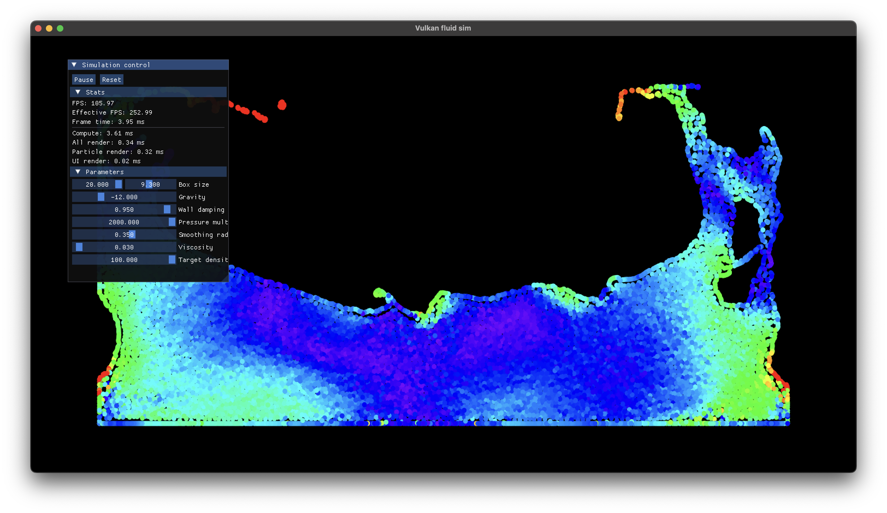

# Vulkan fluid simulation

This is a simple 2D SPH fluid simulation written in C++ and Vulkan. All the simulation is done through compute shaders and all the data buffers are kept in the GPU.

## Building

To build the project, you will need

- A compiler with C++20 support
- CMake
- Vulkan SDK

CMake will download almost all dependencies, except the Vulkan SDK which must be in the path.

## Credits

Some other dependencies used in this small project are

- Dear ImGui
- Vulkan bootstrap
- Vulkan Memory Allocator
- fmt
- glm

Also a bit thanks to Sebastien Lague's project [SebLague/Fluid-Sim](https://github.com/SebLague/Fluid-Sim) which served as the main inspiration and base of this project.
